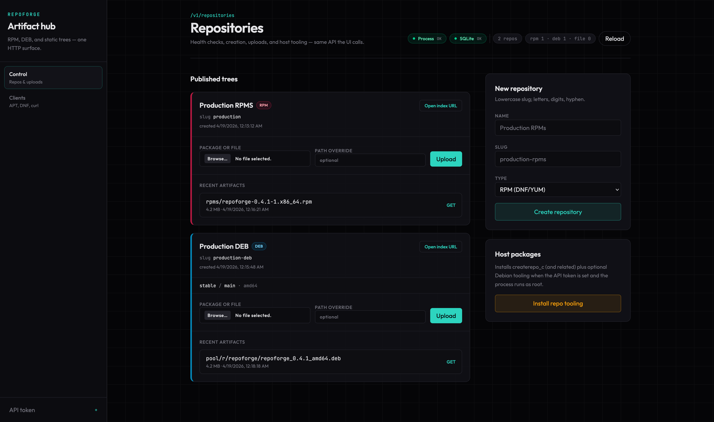

# repoforge

Small Go service that stores uploaded artifacts on disk, tracks metadata in **SQLite**, exposes a **REST API** and a **web UI**, and rebuilds **APT** and **RPM** repository indexes so clients can consume repositories over plain HTTP.

## Screenshots

Web dashboard (repositories, uploads, health, bearer token):



## Version

The current release is **0.4.2**. See [CHANGELOG.md](CHANGELOG.md) for release history. This project uses [Semantic Versioning](https://semver.org/spec/v2.0.0.html) and [Keep a Changelog](https://keepachangelog.com/en/1.1.0/) conventions.

## Documentation

- **[Configuration](docs/CONFIGURATION.md)** — environment variables, `systemd`, `/etc/repoforge.env`
- **[Development](docs/DEVELOPMENT.md)** — build from source, local FPM packages, repository layout on disk
- **[REST API examples](docs/REST.md)** — `curl` for `/v1` and install-repo tooling

## Install from GitHub (Linux)

Published **`.deb`** and **`.rpm`** files attach to the [latest GitHub Release](https://github.com/CloudVisionApps/RepoForge/releases/latest) when a `v*` tag is built (see [`.github/workflows/package-release.yml`](.github/workflows/package-release.yml)).

**One-liner** (needs `curl`, `python3`, and `sudo` unless you are already root; picks `.deb` on Debian/Ubuntu or `.rpm` on Fedora/RHEL-like systems, for **amd64** or **aarch64**):

```bash
curl -fsSL https://raw.githubusercontent.com/CloudVisionApps/RepoForge/main/scripts/install-latest-linux.sh | sudo bash
```

Use another GitHub repo (fork or mirror) by setting **`REPOFORGE_GITHUB_REPO`** before running:

```bash
curl -fsSL https://raw.githubusercontent.com/CloudVisionApps/RepoForge/main/scripts/install-latest-linux.sh | sudo env REPOFORGE_GITHUB_REPO=you/YourFork bash
```

The script lives in the repo as [`scripts/install-latest-linux.sh`](scripts/install-latest-linux.sh). Prefer downloading it, reviewing it, then executing:

```bash
curl -fsSL -o install-repoforge.sh https://raw.githubusercontent.com/CloudVisionApps/RepoForge/main/scripts/install-latest-linux.sh
less install-repoforge.sh
sudo bash install-repoforge.sh
```

## Client-facing HTTP (static tree)

Published files are served from:

`GET /repo/{slug}/{path}`

Examples after uploading `hello_amd64.deb` to `deb-demo`:

```bash
curl -sS localhost:8080/repo/deb-demo/dists/noble/main/binary-amd64/Packages
curl -sS localhost:8080/repo/deb-demo/pool/h/hello/hello_1.0_amd64.deb
```

### APT (`deb` repo)

`/etc/apt/sources.list.d/repoforge.list`:

```
deb [trusted=yes] http://YOUR_HOST:8080/repo/deb-demo noble main
```

Use `trusted=yes` only if you are not signing `Release` (this service does not sign in v1).

### DNF / YUM (`rpm` repo)

`/etc/yum.repos.d/repoforge.repo`:

```
[repoforge]
name=repoforge
baseurl=http://YOUR_HOST:8080/repo/rpm-demo/rpms
enabled=1
gpgcheck=0
```

`createrepo_c` writes `repodata/` next to the `.rpm` files under `rpms/`, so the `baseurl` should point at that directory.

For local development on macOS and RPM indexing, see [Development](docs/DEVELOPMENT.md).
